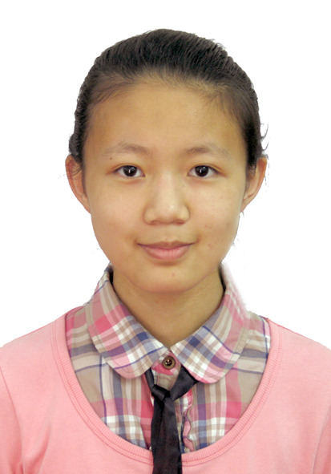

  * Done Command
* Code written: [[functional code](https://github.com/CS2103JAN2017-F14-B3/main/blob/master/collated/main/A0135998H.md)]
[[test](https://github.com/CS2103JAN2017-F14-B3/main/blob/master/collated/test/A0135998H.md)]
* Other Major Contributions:
 * Reskin UI design 
 * Wrote User Guide
 
-----

#### [Tan Li Hao](https://github.com/LiHaoTan)
 
Year 2 Computer Science Major 
**Role**: Developer  
**Responsibilities**: Testing, Integration  
* Components in charge of: Logic 
* Features implemented:
* Code written: [[functional code](https://github.com/CS2103JAN2017-F14-B3/main/blob/master/collated/main/A0140023E.md)] 
[[test](https://github.com/CS2103JAN2017-F14-B3/main/blob/master/collated/test/A0140023E.md)]
* Other Major Contributions:

-----

#### [Liu Yulin](https://github.com/LiuYulin0629)
 
Year 2 Computer Science Major 
**Role**: Developer  
**Responsibilities**: Code quality  
* Components in charge of: Model, Storage
* Features implemented:
* Code written: [[functional code](https://github.com/CS2103JAN2017-F14-B3/main/blob/master/collated/main/A0148052L.md)]
* Other Major Contributions:

-----
#### [Nirandika Wanigasekara](https://github.com/nirandiw)
 
**Role**: Tutor

-----
